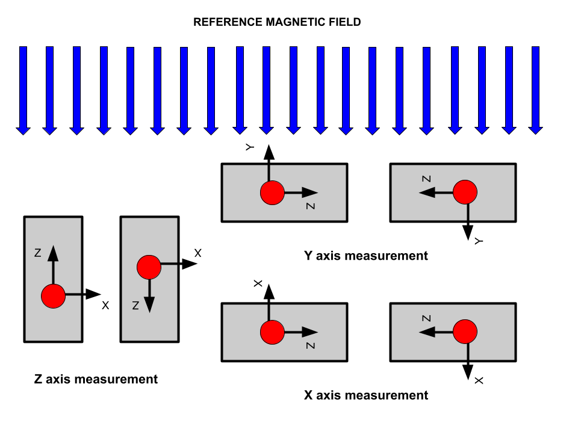

# Magnetometer calibration techniques

# Introduction
The following repository contains three different script for the calibration of a tri-axes magnetometer which needs to be calibrated for hard/soft ferromagnetic interfernce and scale factors .
The three calibration procedure proposed herein are **Manual Calibration(MC)**,**Non-Linear Least Square Calibration (NLLS)** and **Adjusted Ordinary Least Square Calibration (ALQ)**.
All the three methods are briefly explained here together with a complete description of how to use the given scripts to solve the calibration for each method.

It is important to note that only scale factor and hard ferromagnetic interfernce will be considered in the calibration as main sources of measurement bias, although non-orthogonalitoes 
and soft ferromagnetic interference are present. The only method that is able to calibrate all the aforementioned sources of bias (hard/soft ferromagnetic interfernce, scale factors and 
non-orthogonalities) is the ALQ method, which development is based on [3]. Both MC and NLLS solve only for hard ferromagnetic inetrfernce (offset from now on) and scale factor.

Given the this semplifications, it is important to define a simple model that describes how the magnetometer senses and external magnetic field. A complete and precise mathematical description of a magnetometer can be found in [3], but a simplified version is given herein for pratical reasons. Each axis of the magnetometer gives one of the three componet of a refernce magnetic field that it is measured (it can be an artificial magnetic field or the geomagnetic fiedl in most of the cases). However, the measurnments along each axis is biased by a ceratain offset (hard ferromagnetic interference) and a ceratin scale factor. This means in the former case that even with zero external field, the magnetomegter senses a nn-zero magnetic field that is diffrent for each axis. In the latter case, the problem is that the external magnetic field is measured with a constant multiplicative factor that is different for each axis. Hence it is possible to describe the measured magnetic field along each axis (x axis of the magnetometer for example) as:

H<sup>sensed</sup> = (H<sup>real</sup> + **off**) x **s**
  
Where H<sup>real</sup> is the true magnetic field componet along one axis, **off** is the offset and **s** is the scale factor. The whole iam of the calibration is to find the value of offset and scale factor for each axis, so that at the end it will be possible to obtain correct measurements from the magnetometer using the obtained calibration parameters. A total of six parameters are to be determined that can be stacked into a vector 

beta = [off<sub>x</sub> off<sub>y</sub> off<sub>z</sub> s<sub>x</sub> s<sub>y</sub> s<sub>z</sub>]

Graphically this correspond in resetting the measurements from an ellipsoid to a sphere with radious equal to the refernce magnetic fiedl intensity. This is becasuse, the magnetic field must always have the same intensity even if the magnetometer is rotating if no bias is affecting the measurements or if the bias is properly calibrated. The compoent of the magnetic field will change as the magnetometer changes orientation, but ideally the magnitude of the magnetic field vecotor must be constant.

||
|:--:| 
| Fig1 : scatter plot  of a batch of random measurements pointing measuremenst taken with the magnetometer |
  
# Manual Calibration

## Description
 
The MC coalibration consist in two simple steps that are to be repeated for each axis, for a total of three times. First it will be necessary to have at disposal a known magnetic field field in both direction and intesity. This can be an external artificial magnetic field or or the geomagnetic field which can be obtained from <code>igrf()</code> in Matlab for example (or an online calculator like the one [here](http://www.geomag.bgs.ac.uk/data_service/models_compass/igrf_calc.html).

Once the refernce is derfined the only task to accomplish is pointing the magnetometer axis aligned with the refernce magnetic field. Then one measurements should be taken in the same direction of the reference and a second one should be taken in the opposit direction. The following figure illustartes the process :


||
|:--:| 
| Fig 2: MC calibration measurnments for calibration|

From this two measurements it is possible to solve for **off** and **s** at each axis axis using this symple system of equations 

H<sup>sensed(+)</sup> = (H<sup>real</sup> + **off**) x **s**

H<sup>sensed(-)</sup> = (-H<sup>real</sup> + **off**) x **s**

where H<sup>real</sup> is known and H<sup>sensed(-)</sup> and H<sup>sensed(+)</sup> are derived from the measurments (in the same and opposite direction of the reference respectively like in the figure above)


## MC Calibration Code
The script that accomplish the MC calibration is the m-file <code>First_order_calibration</code>. in the preamble of the script you are requested to insert the main parameters of the IGRF refernce geomagnetic field at your location since this values will be used in your calibration.
The following is an example of the preamble you will find

```
$ %%  Calibration  Parameters from IGRF Model :

$ dec_mag = 6.880;                % [deg] Declination ((+)eastward) 
$ inc_mag = 72.798;               % [deg] Inclination ((+)downward)
$ M_int   = 51.668;               % [microT]                           

$ %% Magnetic field decomposition

$ M_down  = M_int*sind(inc_mag);                 %(positive downward)
$ M_est   = M_int*cosd(inc_mag)*sind(dec_mag);
$ M_north = M_int*cosd(inc_mag)*cosd(dec_mag);
$ M_ref   = M_int;                               % the reference direction used for
                                                 % for the calibration
$ %% MEASURED OUTPUTS : TO BE INSERTED MANUALLY

$ magx_axis_pos_test =    124.941;    % [microT] microTesla
$ magx_axis_neg_test =   -101.53 ;    % [microT] microTesla
$ magy_axis_pos_test =    90.9156;    % [microT] microTesla
$ magy_axis_neg_test =   -99.2445 ;   % [microT] microTesla
$ magz_axis_pos_test =    63.3693;    % [microT] microTesla
$ magz_axis_neg_test =   -155.81;     % [microT] microTesla
```

for each direction (take x for example) you must specify the measured magnetic field once the x-axis is aliged with the refernce and insert the value under ```magx_axis_pos_test```  and the second measuremnt must substituded in ```magx_axis_neg_test```. Remeber to select the refernce componet you are using under the variable ```M_ref```that in this example is the full-intensity direction of the magnetic field.

The code will automatically output the parameters for the calibration that will be used to calibration of the successive measurements.
```
––––––––––––––––––––––––––––––––––––––––––––––
––––––––––––––––––––––––––––––––––––––––––––––
offset in x       : 5.34108 microT
offset in y       : -2.26303 microT
offset in z       : -21.7914 microT

scale factor in x : 2.1916 
scale factor in y : 1.84021 
scale factor in z : 2.12104 
––––––––––––––––––––––––––––––––––––––––––––––
––––––––––––––––––––––––––––––––––––––––––––––
```

In specific, the calibrated measurment along each axis will be 

H<sub>calibrated</sub> = H<sub>measured</sub> x Scale<sup>^-1</sup>-offset


# NLLS Calibration 
The NLLS calibration is accomplished using a non linear model describing the offset in the norm square between a given model function *f* and the real refernce magnetic field intensity H^2. The problem consist in finding the solution to 

min(S) = min(sum(H^2-f<sub>i</sub>(H_<sub>x</sub>,<sub>y</sub>,H<sub>z</sub>,beta)^2)) for i=1,2,3 .. N

where ```f=((mx/sx-offx)).^2+((my/sy-offy)).^2+((mz/sz-offz)).^2```and beta is a short notation that includes all the scale factors and the offset which are the main parameters to be found as a solution of the Least Square problem. The problem will require an iterative process that implements a Newton-Gauss solution method. This is simply a multidimensional version of the classical newthon-raphson. The solution of the problem is sensible to the starting condition, so it is necassiry to have at least a vague idea of the scale factors and offset for each axis. It can be a good idea to first aplly a MC calibration and use the output as  a first guess for the NLLS script.

## NLLS Calibration Code
The NLLS calibration is entirely automated in the m-file ```fitter.m```. In the preamble of the function you will find a loaded file ```Mag_batch``` which contains a set of random measurment taken rotating the magnetometer randomly. This is matrix 3xN where N is the number of samples that are stored in the your file. The preamble of the function is the following

```
clear all
close all
load 'mag_batch' % load the random measurments 

% LOAD YOUR OWN OBSERVATIONS 

decimation      = 1/5                            ; % Decimation of the total observed measuremnts 
observation     = mag_batch(1:1/decimation:end,:); % save the measured magnetic field as variable observation after appling the decimation
observation_cor = observation                    ; % corrected observation. It will be updated later

%% Parameters initilization

syms         offx offy offz sx sy sz   ;    % Variables initialization
var_vec    = [offx offy offz sx sy sz] ;    % Vector of the variables 
H          = (51668*10^-9)*10^6        ;    % [muT] microtesla magnetic field intensity at the location of the measurements
it         = 10                        ;    % Number of iterations in the method

%% Model Implementation

f=@(mx,my,mz)((mx/sx-offx)).^2+((my/sy-offy)).^2+((mz/sz-offz)).^2;

% The function is half-symbolic and half-handle. I want to create multiple 
% symbolic functions starting from the observations 

%% Values Initialization

% CHANGE THE FIRST GUESS IF NECESSARY 
% FIRST GUESS  = [offx      offy     offz   sx   sy sz ]

beta_k         = [9 -10 -16  2   2  2]';  % starting guess

```
The parameters that are to be initialised are summarised here :
|Parameter        | Description                                                                              |
| ------          | ------ |
|```decimation``` |where you can decide how to reduce the number of samples used in the algorithm if necessary|
|```it```         |number of iteration used in the process                                                    |
|```H```          |magnetic field intensity at the location of the calibration                                |
|```beta_k```     |starting guess solution                                                                    |

Once this parameters are defined, the script solves the probelm automatically and the results are output from the code anologously at the MC method. 


# Adjuasted Least Square Calibration
The ALS method is conceptually identical to the NLLS method exept for the fact that the model *f* is linear. This fact results in a saving in computational time and the elimination of any dependancy from an initial guess. The mathematical proofs and logic behind the method are fully explained in [1] and [2]. No indeepth analysis will be given herein. However it is intersting to understanf which one is the model imlemeted by this method.

The model f  is 

f = A^-1(H_<sub>measured</sub>) - offset

where A is named shape matric and it is uknown. A contains the scale factors in the diagonal and additional off-diagonal parameters that take into account for non-orthogonalities in the axes of the magnetometer. H_<sub>measured</sub> is the 3x1 vector containing a single measurement from the magnetometer for example. offset is the usual herd ferromagnetic field interfernce.

the solution to the probelm is found minimising the sum of the resifuals squared :

min(S) = min(sum(H^2-(A^-1(H_<sub>measured</sub>) - offset)^2) for i=1,2,3 .. N

which is equivalent to find the shape matrix A that best fits a set of H_<sub>measured</sub> to an ellipsoid.

## ALS Calibration Code
The script ```ALS_calibration.m``` solves the ALS calibration. For this script it only necessary to load the proper random measurements set and update the magnetic field intensity at the location of the calibartion : 

```
clear all
close all
load 'mag_batch'                              % Load Here your random set

decimation        = 1                      ;
n                 = 3                      ;
Mag_obs           = mag_batch(1:end,1:n).' ;  % MATRIX OF THE OBSERVATIONS  3xn 
observation       = Mag_obs                ;
sigma             = .86                    ;  % uT^2 worse case scenario obtained from observation
H                 = 51                     ;  % microT 
[rows,ncol]       = size(Mag_obs)          ;

```

The parameter ```sigma``` refers to the variance of the noise affecting  the measurments and can be estimated by plotting the measurment profile over time with the magnetometer fixed in space(Fig 3). Once you have the profile over time, it is possible to estimate the variance of the soise affecting the measurement along each axis and the largest value will be uploaded in the code. Once again it is possible to use the parameter ```decimation```in order to decimate the number of sample used in the algorithm.

The solution to the problem will be given as the matrix A which contains the scale factors in the diagonal and the vector off that has the name ```b``` in the code. All the variable in the code follow the notation used in [1].

||
|:--:| 
| Fig 2: MC calibration measurnments for calibration|

The Graphical result from the calibration can be appreciated by Fig3. The sphere represent the ideal magnetometer measurments which shoul all have the same intensity equal to the external magnetoic field intensity for any given random direction. The blue dots are rest on the ideal sphere after the calibartion is succesfully accomplished.

# Summary 

|LIST OF FUNCTIONS|Brief Description|
|---------------- |---|
|```ALS_calibration.m.```        | ALS Calibration script|
|```Calibration_data.mat. ```    | File where you can same your solved parameters after each calibartion|
|```First_order_calibration.m``` | MC calibration script|
|```fitter.m        ```          | NLLS calibration script|
|```mag_batch.mat  ```           | Batch of random measurments to use as samples for the calibration algorithms|
|```vec_s_inv.m   ```            | Auxiliary routine needed for ALS calibration|
|``` vec_s.m     ```             | Auxiliary routine needed for ALS calibration|


# References

[1] Markovsky, Ivan & Kukush, Alexander & Huffel, Sabine. (2004).* Consistent least squares fitting of ellipsoids*. Numerische Mathematik. 98. 10.1007/s00211-004-0526-9. 

[2] Renaudin, Valérie, Muhammad Haris Afzal, and Gérard Lachapelle. *Complete triaxis magnetometer calibration in the magnetic domain.* Journal of sensors 2010 (2010).

[3] Kelley, Carl T. Iterative methods for optimization. Society for Industrial and Applied Mathematics, 1999.
